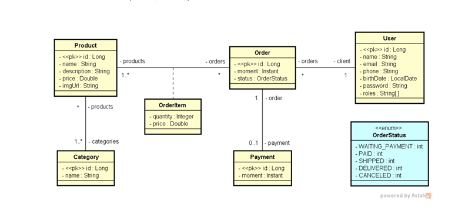

# 🛒 DSCommerce Backend


**Backend do sistema DSCommerce** - Uma API REST completa para e-commerce, desenvolvida durante o curso de especialização em Java e Spring Boot (DevSuperior).



---

## 📌 Sobre o Projeto

O **DSCommerce** é uma aplicação backend robusta, projetada para demonstrar conhecimentos fundamentais do ecossistema Java/Spring e arquitetura de sistemas modernos. O sistema implementa fluxos complexos de comércio eletrônico, incluindo gestão de pedidos, controle de estoque virtual, autenticação e relatórios.

### ✨ Destaques Técnicos
- **Arquitetura em Camadas:** Separação clara entre Controllers, Services e Repositories.
- **Modelo de Domínio Rico:** Exploração profunda de relacionamentos JPA (1:N, N:N) e classes de associação.
- **Segurança Profissional:** Implementação de OAuth2 e JWT com Spring Security.
- **Tratamento de Erros:** Exception Handlers globais para respostas HTTP padronizadas.
- **Qualidade de Código:** Uso de DTOs (Data Transfer Objects) para desacoplar a API do banco de dados.

---

## ☁️ Infraestrutura e Deploy (Home Lab)

Diferente de projetos acadêmicos que rodam apenas em `localhost`, esta aplicação foi **deployada em um servidor Linux real** (Raspberry Pi), simulando um ambiente de produção "Private Cloud".

* **Servidor:** Raspberry Pi 4 (Linux/Debian).
* **Containerização:** Aplicação e Banco de Dados (PostgreSQL) rodando em containers **Docker**, orquestrados via Docker Network.
* **Acesso Remoto Seguro:** Configuração de túnel via **Tailscale**, permitindo acesso à API de qualquer lugar do mundo (via 4G/internet externa) sem expor portas vulneráveis do roteador.
* **Desafios Superados:** Migração do banco H2 para Postgres em produção e build de imagem Docker otimizada para arquitetura ARM64.

---

## 🎯 Competências Desenvolvidas

Este projeto consolidou os seguintes conhecimentos práticos:

- [x] Implementação de autenticação e autorização *stateless* com **JWT**.
- [x] Modelagem de domínio complexo com **JPA/Hibernate** e seed de banco de dados.
- [x] Gerenciamento de transações e garantia de **integridade referencial**.
- [x] Consultas otimizadas, paginação e filtros de busca.
- [x] Controle de acesso granular baseado em perfis (**RBAC**).
- [x] Validação de dados com **Bean Validation** em múltiplas camadas.
- [x] Lógica de carrinho de compras com persistência volátil e efetivação em pedido.
- [x] Configuração de ambiente Linux e Docker para deploy.

---

## 🗄️ Modelo Conceitual

O sistema resolve desafios clássicos de modelagem de e-commerce:

1. **Histórico de Preços:** O preço é armazenado na tabela `OrderItem` para garantir que, se o preço do produto mudar no futuro, o histórico dos pedidos antigos permaneça correto.
2. **Muitos-para-Muitos (N:N):** Produtos e Categorias relacionam-se de forma que um produto pode ter várias categorias.
3. **Classe de Associação:** O relacionamento entre `Order` e `Product` gera a entidade `OrderItem`, que carrega atributos extras (quantidade e preço no momento da compra).

---

## 🚀 Como Executar Localmente

### Pré-requisitos
- Java 21
- Maven
- Git
- Docker (Opcional, caso queira rodar o banco em container)

### Instalação

```bash
# 1. Clone o repositório
git clone [https://github.com/Joao-Victor-Teixeira/dscommerce-backend.git](https://github.com/Joao-Victor-Teixeira/dscommerce-backend.git)

# 2. Entre no diretório
cd dscommerce-backend

# 3. Execute o projeto
./mvnw spring-boot:run
A aplicação estará disponível em: http://localhost:8080⚙️ Perfis de ExecuçãoPerfilBanco de DadosDescriçãoConfiguraçãodevH2 DatabaseBanco em memória, ideal para testes rápidos e desenvolvimento.spring.profiles.active=devConsole: /h2-consoleprodPostgreSQLBanco robusto real, utilizado no deploy do Docker.spring.profiles.active=prod🧪 Endpoints da API🔓 PúblicosMétodoRotaDescriçãoGET/productsLista produtos (paginado)GET/products/{id}Detalhes de um produtoPOST/auth/loginAutenticação (Retorna Bearer Token)POST/auth/signupCriar nova conta🔒 Cliente (Autenticado)MétodoRotaDescriçãoGET/orders/mineHistórico de pedidos do usuário logadoPOST/ordersRegistrar novo pedidoGET/users/meConsultar dados do perfil🛡️ Administrador (Role ADMIN)MétodoRotaDescriçãoPOST/productsCadastrar produtoPUT/products/{id}Atualizar produtoDELETE/products/{id}Deletar produtoGET/ordersRelatório de todos os pedidosPOST/paymentsRegistrar pagamento<p align="center">👨‍💻 <b>João Victor Teixeira</b><i>Desenvolvido durante a formação Java Spring Professional da <a href="https://devsuperior.com.br">DevSuperior</a>.</i></p>
